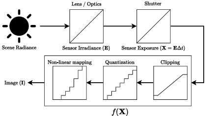
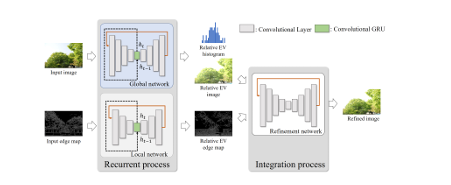
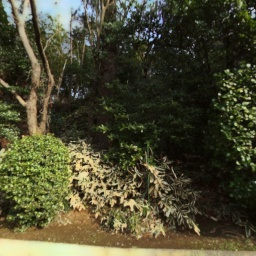
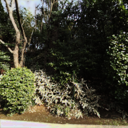

# High Dynamic Range Image Reconstruction from Single LDR Image

## 项目概况
**组员分工**：
||胡俊敏|赖俊霖|习程一|
|:---:|:---:|:---:|:---:|
|贡献度|4|4|2|
|完成任务|论文查找、完成第一阶段代码的修改以及运行和项目报告主要撰写|论文查找、完成第二阶段的代码修改及运行和和第二阶段的项目报告撰写|论文查找、项目ppt制作、项目描述视频的制作|

## 数据集
**阶段1数据集**
[DrTMO](https://uithcm-my.sharepoint.com/personal/17520474_ms_uit_edu_vn/_layouts/15/onedrive.aspx?id=%2Fpersonal%2F17520474%5Fms%5Fuit%5Fedu%5Fvn%2FDocuments%2FVinAI%2Fsingle%2Dimage%2Dhdr%2Fdrtmo%2Dtrain%2Dtest%2Dbracketed%2Ezip&parent=%2Fpersonal%2F17520474%5Fms%5Fuit%5Fedu%5Fvn%2FDocuments%2FVinAI%2Fsingle%2Dimage%2Dhdr&ga=1)解压放到项目文件中

**阶段2数据集**[VDS](https://drive.google.com/file/d/1t9jmy4IbesieE5r6D6IXuR-t98xOi9oY/view?usp=sharing)解压放到dataset文件中

## 环境
显卡为RTX3060移动端，显存为6GB。由于计算资源不足，所以我们跳过了训练部分，直接下载权重，然后进行实验。[权重1](https://uithcm-my.sharepoint.com/personal/17520474_ms_uit_edu_vn/_layouts/15/onedrive.aspx?id=%2Fpersonal%2F17520474%5Fms%5Fuit%5Fedu%5Fvn%2FDocuments%2FVinAI%2Fsingle%2Dimage%2Dhdr%2Fpretrained%2Eckpt&parent=%2Fpersonal%2F17520474%5Fms%5Fuit%5Fedu%5Fvn%2FDocuments%2FVinAI%2Fsingle%2Dimage%2Dhdr&ga=1)放到项目中，[权重2](https://pan.baidu.com/share/init?surl=2tKInozQK5dRRoKQ_H39Pw&pwd=tqhr)放到result文件夹下。

依赖包参见requirements.txt

## 摘要

高动态范围（HDR）图像技术通过克服传统低动态范围（LDR）图像在高对比度场景中的不足，能够更真实地还原现实世界的光照条件。传统的HDR图像生成依赖于多曝光融合方法，需要多次拍摄和特定设备，而直接获取HDR图像成本高且复杂。为此，本文提出了一种从单张LDR图像生成HDR图像的新方法。该方法首先通过神经网络生成多张不同曝光度的图像，然后利用HDR合成技术将这些图像合成为HDR图像。实验结果表明，所提方法能够有效地恢复图像细节并提升视觉质量，与传统方法相比具有较高的PSNR、SSIM和MSSIM指标。本文提出的方法在图像质量和细节还原方面表现出色，为从单张LDR图像生成高质量HDR图像提供了新思路。

## 1.引言

高动态范围（HDR, High Dynamic Range）图像技术是一种旨在克服传统图像在高对比度场景中表现不足问题的方法。传统的图像技术通常只能捕捉有限的动态范围，这意味着在亮度和暗部细节同时存在的场景中，往往会出现细节丢失的问题。例如，在日出或日落的场景中，普通照片可能无法同时清晰地展示天空和地面细节。通常，HDR图像捕获依赖于多曝光融合方法[1]。HDR技术通过捕捉和合并不同曝光时间的多张图片，能够显著提升图像的动态范围，从而更真实地还原现实世界的光照条件。然而，基于多张图片的HDR生成方法需要多次拍摄，并且对拍摄设备和环境有较高要求，例如需要保持相机的稳定性以及快速连续拍摄，以避免图像的错位或运动模糊。

由于直接获取HDR图像实际上是棘手的，并且需要昂贵的成像设备，因此使用低动态范围（LDR, Low Dynamic Range）图像的HDR成像技术正在引起相当大的关注[2]。这一技术通过利用先进的图像处理算法和机器学习模型，从一张低动态范围（LDR, Low Dynamic Range）图像中推断出更广泛的亮度和色彩信息，从而生成接近真实场景的HDR图像。这种方法极大地方便了HDR图像的获取，因为它不再依赖多次拍摄和特定的硬件设备，只需要一张普通的照片即可实现HDR效果。

单张图片生成HDR图像的关键在于如何有效地预测和重建图像中的细节和亮度信息。当前，许多研究和应用都集中在使用深度学习技术，特别是卷积神经网络（CNN, Convolutional Neural Networks）[3]和生成对抗网络（GAN, Generative Adversarial Networks）[4]来实现这一目标。这些模型通过对大量图像数据的训练，能够学习到复杂的图像特征，从而在推断过程中准确地重建HDR效果。然而，由于在重建过程中细节的缺失，结果仍存在一定的不足，无法令人完全满意。

针对这一问题，我们提出了一种基于两个阶段的方法，即首先由低动态范围的图像生成多张对齐度良好的不同曝光图像[5]，然后对生成的多张曝光度不同的图像进行合成。在这一过程中，我们采用了两种方法。第一种方法是通过估计每个像素的辐照度来合成HDR图像[6]。第二种方法则是采用可微分HDRI合成方法，即给定不同曝光的LDR图像，估计相机响应函数（CRF）或其逆函数（逆CRF）[7]。通过这些方法，我们期望能够生成更加准确和细节丰富的HDR图像，从而提升图像质量和视觉体验。

## 2.相关工作
**基于单图像生成多曝光图像的重建**
Phuoc-Hieu Le, Quynh Le, Rang Nguyen, Binh-Son Hua（2022）[5]()设计了一个端到端可训练的神经网络，包括HDR编码网络（HDR Encoding Net）、上曝光网络（Up-Exposure Net）和下曝光网络（Down-Exposure Net），用于从单个输入图像生成不同曝光的图像，并提出了一种新颖的弱监督学习框架，用于从单个图像生成用于HDR重建的多重曝光图像，而无需依赖于成对的地面真实HDR图像。

**多曝光图像的高动态范围图像合成**
Jung Hee Kim, Siyeong Lee, Suk-Ju Kang1[7]()提出了一个具有可微分HDRI合成方法的新框架。应用了可微分的CRF函数，该函数将离散像素强度值转换为标准HDRI中的亮度值。网络能够避免仅关注曝光转移任务的局部最优解，从而生成没有局部反转伪影的高质量HDR图像。除此之外，结合了图像分解方法来重建HDR图像，专注于在曝光转移任务中保留图像细节，通过双通道方法分离了曝光转移任务，分别调整全局色调和重建图像的局部结构。

## 3.我们的方法

### 3.1 创建多曝光图像

**方法1**[5]()
#### 3.1.2 方法
基本思想是让网络学习从单个输入图像生成多个曝光，然后按照传统的HDR流程从生成的曝光中重建HDR。让我们从我们的相机图像形成流程开始。

我们通常将相机图像处理流程中的图像I建模为一个函数f(X)，它将场景辐照度E在曝光时间∆t内的积分转换过来。光度测量X = E∆t是线性的，基于光传输的物理模型，函数f(X)是在相机内信号处理中发生的所有非线性的组合，例如相机响应函数、裁剪、量化和其他非线性映射。在这个模型中，传感器辐照度E捕获场景的高动态范围信号，图像I代表用于显示的低动态范围（LDR）信号。请注意，我们假设过程中的噪声可以忽略不计。因此，我们决定将其从流程中排除。为了执行HDR重建，我们的目标是反转这个图像形成模型，从图像I中恢复传感器辐照度E，以便$E = f^{-1} (I) /∆t$。这意味着我们必须反转f(X)中捕获的非线性。不幸的是，这是一个具有挑战性的问题，因为f(X)中的一些步骤是不可逆的，例如裁剪，而相机响应函数因相机而异，通常被认为是专有的。为了解决这个问题，我们选择数据驱动的方法，并提出使用CNN来学习流程反转。
#### 3.1.3 网络构建

##### 3.1.3.1 HDR Encoding Net (N1)

神经网络中负责将输入的低动态范围图像转换为传感器曝光表示的组件。它采用U-Net架构，具有编码器-解码器结构和跳跃连接，以保持低级特征的细节。N1通过网络的多个卷积层和激活函数提取特征，并通过双曲正切激活函数调整输出，使其成为适合生成不同曝光图像的表示。网络的输出与输入图像相加以进行全局调整，并通过损失函数进行训练，包括HDR表示损失，以确保不同曝光图像的一致性。此外，N1在处理输入图像时可能会应用掩膜来忽略过曝或欠曝区域，从而让网络专注于正确曝光的区域。通过这种方式，N1为生成逼真的多重曝光图像提供了基础，这些图像随后可以用于HDR图像的重建。

##### 3.1.3.2 Up-Exposure Net (N2) 和 Down-Exposure Net (N3)
神经网络中用于生成不同曝光水平图像的两个子网络。它们基于U-Net架构，利用编码器-解码器结构和跳跃连接来提取和重组特征，确保生成图像的细节丰富性。这两个网络接收来自HDR Encoding Net (N1)的潜在表示作为输入，并处理这些特征以产生上曝光和下曝光的图像。它们在最后一层使用归一化的双曲正切激活函数来输出在[0, 1]范围内的归一化图像，这个激活函数有助于加快学习过程并优化网络性能。在训练时，N2和N3通过重建损失和感知损失等损失函数来确保生成图像的视觉质量和真实性。此外，推理过程中，N2和N3能够根据所需的曝光水平生成新的图像，这些图像最终与传统HDR重建方法结合，形成高质量的HDR图像。

##### 3.1.3.3 激活函数：
HDR Encoding Net使用双曲正切（tanh）激活函数，然后与输入图像相加以进行全局调整。
Up-Exposure Net和Down-Exposure Net使用归一化的tanh激活函数（tanhnorm），输出值在[0, 1]范围内，用于生成归一化的图像。

##### 3.1.3.4 损失函数
**HDR表示损失（HDR Representation Loss, $L_h$）** 这个损失用于确保从不同曝光图像中恢复的潜在表示在数学上与相应的曝光时间成比例。它基于对数域中的变换损失，以减少大误差的影响，并鼓励网络恢复更多细节。
**重建损失（Reconstruction Loss, $L_r$）** 这个损失用于监督上曝光网络（N2）和下曝光网络（N3），作为图像到图像转换任务的一部分。它通常采用像素级的ℓ1-范数或ℓ2-范数，以确保生成的图像在像素级别与目标图像相似。
**感知损失（Perceptual Loss, $L_p$）** 这个损失用于评估预测图像与真实图像在特征层面的相似度。它通过比较VGG网络不同层提取的特征来实现，有助于减少视觉伪影并创造更真实的细节。
**总变分损失（Total Variation Loss, $L_tv$）** 这个损失用于提高推断图像的空间平滑性，避免过拟合。它基于图像的总变分，计算图像中像素级变化的总和。**最终的组合损失函数 L**
$$L = λ_hL_h + λ_rL_r + λ_pL_p + λ_tvL_tv$$

##### 3.1.3.5 掩膜区域（Masked Regions）
通过在训练和推理阶段识别并区分图像中的过曝和欠曝区域，然后对这些区域进行特殊处理，使得网络能够专注于学习图像中正确曝光的部分。通过将输入图像从RGB转换到YUV色彩空间，并使用亮度信息来确定曝光状态，可以创建一个软掩膜，该掩膜在正确曝光的区域分配高值，在过曝或欠曝的区域分配低值。应用这个掩膜可以忽略不可靠的像素，让网络在训练时提高对动态范围的处理能力，在推理时生成高质量的HDR图像，同时减少细节丢失和视觉伪影。

**方法2**[7]()

单生多采取了递归上升和递归下降网络。由于该过程被定义为递归过程，使用了卷积门控循环单元（ConvGRU）来构建递归网络。
由于多曝光图像在曝光值方面具有不同的过曝和欠曝区域，将曝光转移任务分解为两个路径——从给定的单个图像中，模型分别使用全局网络和局部网络学习全局色调和局部细节。通过分解的图像，细化网络集成全局和局部组件以生成微调图像。
下图展示了模型中子网络的结构。

递归上升和递归下降网络包含三个子网络的U-Net结构，用于将曝光转移到具有相对上和下EV的图像：全局、局部和细化网络。全局和局部网络分别构建为5级和4级结构，每个级别有2个卷积层。在每个卷积层上实现了Swish激活，以减轻循环模型中的梯度消失问题。细化网络与全局网络具有相同的结构，除了瓶颈层上的Conv-GRUs。全局和局部网络专注于适应性地响应递归次数，细化网络专注于集成全局和局部组件——目标LDR图像的全局色调和基于梯度的边缘结构。
递归上升（或递归下降）网络利用相同的权重来转移曝光，即使递归状态与输入的曝光值不同。然而，递归上升和递归下降网络都应该适应性地产生与输入的曝光值相对应的过曝和欠曝图像，因此，使用条件实例归一化来标准化不同曝光值的特征图。归一化将形状为C × H × W的特征图X转换为归一化图Y，使用两个可学习的参数γe和βe，以及目标曝光值e，它们在RC中。归一化图规定为$Y = (\gamma {e}({X - \mu}) + \beta {e})/\sigma$
，其中μ和σ分别是在空间轴上取的X的平均值和标准差。

### 3.2 生成HDR图像

**方法1**[6]()

传统的成像设备在捕捉场景时受到动态范围的限制。这意味着在亮区和暗区之间的极端辐射度值差异可能无法被完整捕捉，导致图像要么曝光不足，要么过曝。为了克服这一限制，作者提出了一种方法，通过拍摄一系列具有不同曝光设置的照片来捕捉场景的完整动态范围。然后，利用这些照片恢复成像过程的响应函数，并据此创建一个单一的高动态范围辐射度图。

#### 3.2.1 利用互易性原理
算法基于成像系统（无论是光化学还是电子的）的物理属性——互易性原理。互易性原理假设，对于给定的曝光量（辐射度和曝光时间的乘积），成像系统的响应是相同的，即使曝光时间和辐射度成反比。

#### 3.2.2 恢复响应函数
**相机响应函数（CRF）估计**
场景辐射和图像中的像素值之间的关系是非线性的，取决于相机的响应函数。Debevec和Malik提出了一种估计响应函数𝑔的方法。
他们假设每个像素的观测值𝑍是场景辐射𝐸和曝光时间𝑡的函数：
$$Z = g(E*t)$$
通过在不同已知曝光时间下拍摄多张照片，他们使用最小二乘法求解响应函数𝑔和辐射值𝐸。他们引入了一平滑项以确保𝑔的平滑性。
**求解方程**
对于曝光时间$t_j$下的每个像素值$𝑍_{ij}，他们使用:
$$Z_{ij} = lnE_i + lnt_j$$
通过多次曝光，他们为𝑔和$ln𝐸$设置了一个线性方程组。求解该方程组可以得到相机响应曲线𝑔和辐射的对数。

#### 3.2.3 构建HDR辐射度图
一旦确定了𝑔他们可以通过结合所有曝光的信息来计算场景中每个像素的辐射值
$$ln E_i = \frac{\sum_{j=1}^{N} w(Z_{ij}) \cdot (g(Z_{ij}) - \ln t_j)}{\sum_{j=1}^{N} w(Z_{ij})}$$
其中，w(Z) 是一个加权函数，以在响应函数最可靠的范围内赋予像素值更多的重要性。加权函数w(Z) 被选择为在中间范围内的像素值权重更高，远离极值（非常暗或非常亮）的像素值权重较低，因为这些值由于噪声和饱和而不太可靠。
#### 3.2.4 输出HDR图像
这个过程的结果是一个辐射图𝐸，它表示场景中的真实辐射值。该辐射图具有高动态范围，能够捕捉阴影和高光中的细节。

**方法2**[7]()
#### 3.2.5 损失函数
$$ L = L_{HDR} + \lambda {exp}(L_{exp}) $$
其中，
$L_{HDR}$
表示 HDR 图像的重建损失，$L_{exp}$表示多曝光堆栈的生成损失，$\lambda {exp}$是平衡两者的重要性权重。

计算生成的 HDR 图像与真实 HDR 图像之间的差异$L_{HDR} = \frac{1}{N} \sum_{i=1}^{N} \| I_{HDR}(i) - I_{HDR}^{GT}(i) \|_2^2$

计算生成的多曝光堆栈与真实多曝光堆栈之间的差异：$L_{exp} = \frac{1}{N} \sum_{i=1}^{N} \sum_{j=1}^{P} \| I_{exp}(i,j) - I_{exp}^{GT}(i,j) \|_2^2$

通过最小化上述损失函数，能够联合优化曝光传递和 HDR 图像合成，生成高质量的 HDR 图像。

#### 3.2.6 Module
下图展示了我们对逆CRF进行分段线性化的方法。

使用Grossberg和Nayar的方法采样像素，根据CRF具有随强度值单调递增的非线性曲线形状的先验假设，将函数线性化为分段线性形式。我们使用分段线性形式重新计算函数值与前一个值之间的差异，如上述公式所示。简单的线性化方法使得梯度可以通过链式法则传播到多曝光堆栈的每个像素。来自亮度值损失的梯度流向每个图像的像素强度值，这通过上述公式对生成的多曝光堆栈施加了相关值的约束。该框架使网络能够同时完成多曝光堆栈生成任务和HDR合成任务，以重建高质量的HDR图像的最优目标。

#### 3.2.7 Train
由于训练资源不足，我们于此部分使用预训练好的[权重](https://pan.baidu.com/s/12tKInozQK5dRRoKQ_H39Pw?pwd=tqhr)

## 4.实验结果

fig.1. 从左到右分别是A：方法1+方法1 B：方法1+方法2 C：方法2+方法2 D：原图

从上文可以看出，A图像在原图的暗部细节部分进行了还原，但是图像的整体变得模糊了，这有可能是最后生成图像，我们进行了resize导致损失了一些细节。而B图像是由论文[5]()复现的结果，还原了部分暗部细节，但是在暗部细节呈现不如A图像好。至于C图像，对比原图在过曝部分，还原更好一点，但是在暗部细节部分，不如A图，在清晰度方面不如B图。

**分别与原图对比**

||A|B|C|
|:---:|:---:|:---:|:---:|
|PSNR|16.599791969190257|24.089443236654468|17.993352929821373|
|SSIM|0.8030183933647008|0.9072940297619022|0.9160392052431195|
|MSSIM|0.7972826370994099|0.9009601970299618|0.9179721592263791|

作为对比项，由我们复现的B图，符合论文[5]()结果展示数值。虽然A的各项指标不如B图，但是从数值上来说，A图依然有很好的图像质量以及结构相似性方面的质量。C图虽然在图像质量上来说，不如B图，但是在在结构相似性方面质量较高。总得来说，由三种方法生成的图像，质量都比较高，取得了良好的结果。
## 5.结论
本文提出了从单张低动态范围（LDR）图像生成高动态范围（HDR）图像的新方法，并进行了详细的实验验证。该方法分为两个主要阶段：首先通过神经网络生成多张不同曝光度的图像，然后通过HDR合成技术将这些图像合成为HDR图像。

在第一个阶段，我们采用了两种不同的方法生成多曝光图像。方法1基于卷积神经网络（CNN）架构，通过HDR编码网络（HDR Encoding Net）、上曝光网络（Up-Exposure Net）和下曝光网络（Down-Exposure Net）生成不同曝光度的图像。方法2则使用了递归上升和递归下降网络，通过全局、局部和细化网络生成多曝光图像。这两种方法都展示了在生成多曝光图像方面的有效性。

在第二个阶段，我们同样采用了两种不同的HDR合成方法。方法1基于传统的辐照度估计算法，通过恢复相机响应函数生成HDR图像。方法2则使用可微分HDRI合成方法，通过估计相机响应函数或其逆函数生成HDR图像。这些方法都证明了在HDR图像生成方面的高效性和准确性。

实验结果表明，不同方法生成的HDR图像在细节还原和视觉质量方面表现各异。方法1生成的图像在暗部细节还原方面表现较好，但整体图像有一定模糊。方法2在过曝部分还原较好，但在暗部细节方面表现稍逊。通过与原图对比的定量分析（PSNR、SSIM、MSSIM），我们复现的多种方法生成的图像均取得了良好的结果，验证了所提方法的有效性。

总体而言，本文提出的两阶段HDR图像生成方法在图像质量和细节还原方面均表现出色，为从单张LDR图像生成高质量HDR图像提供了新思路和新方法。未来的研究可以进一步优化网络结构和训练策略，以提高生成图像的质量和计算效率。

## 参考文献

- [1] [Paul E. Debevec and Jitendra Malik. 1997. Recovering High Dynamic Range Radiance Maps from Photographs. In Proceedings of the 24th Annual Conference on Computer Graphics and Interactive Techniques (SIGGRAPH ’97). ACM Press/Addison-Wesley Publishing Co., USA, 369–378.](https://doi.org/10.1145/258734.258884)

- [2] [Chung, H., & Cho, N. I. (2022). High dynamic range imaging of dynamic scenes with saturation compensation but without explicit motion compensation. In Proceedings of the IEEE/CVF Winter Conference on Applications of Computer Vision (pp. 2951-2961).]()

- [3] [Zhiyuan Pu, Peiyao Guo, M Salman Asif, and Zhan Ma. Ro bust high dynamic range (hdr) imaging with complex mo tion and parallax. In Proceedings of the Asian Conference on Computer Vision, 2020.]()

- [4] [Yu-Lun Liu, Wei-Sheng Lai, Yu-Sheng Chen, Yi-Lung Kao, Ming-Hsuan Yang, Yung-Yu Chuang, and Jia-Bin Huang. Single-image hdr reconstruction by learning to reverse the camera pipeline. In Proceedings of the IEEE/CVF Confer ence on Computer Vision and Pattern Recognition, pages 1651–1660, 2020.]()

- [5] [arXiv:2210.15897](https://doi.org/10.48550/arXiv.2210.15897)

- [6] [Debevec P E, Malik J. Recovering high dynamic range radiance maps from photographs[M]//Seminal Graphics Papers: Pushing the Boundaries, Volume 2. 2023: 643-652.]()

- [7] [arXiv:2006.15833](https://arxiv.org/abs/2006.15833)